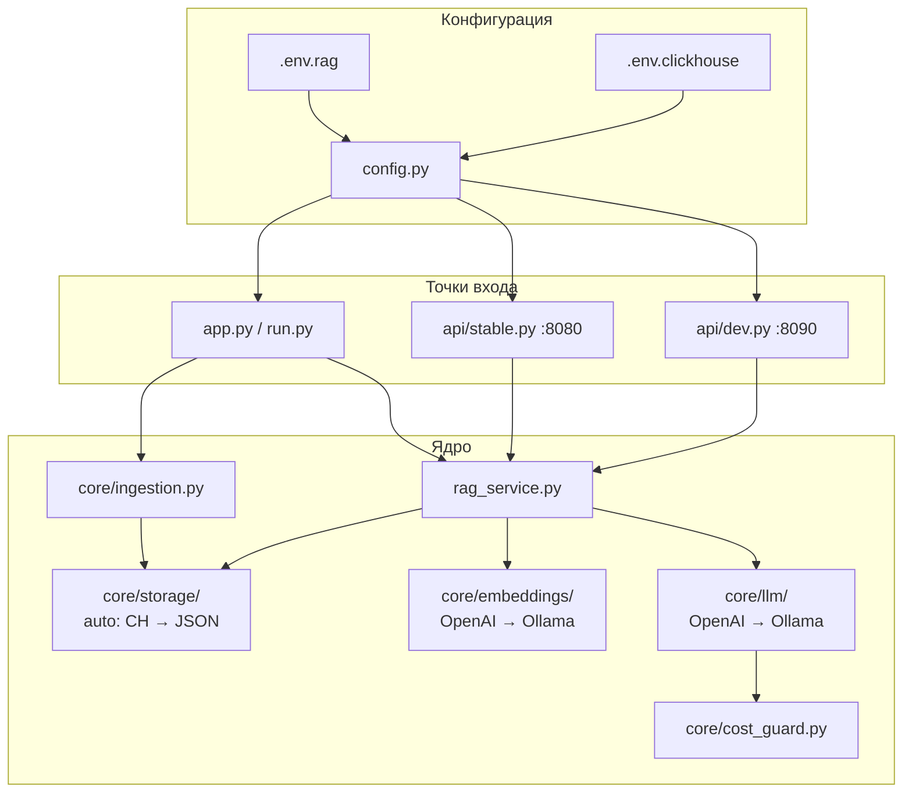
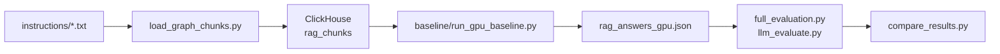

# MCP Layer — унифицированная RAG-система

Python-система для индексации документов, ответов на вопросы через RAG с гибридным хранилищем (ClickHouse + JSON) и автоматическим переключением LLM (OpenAI → Ollama).

---

## Что делает модуль

**Unified RAG (основной путь):**

- Гибридное векторное хранилище: ClickHouse (продакшен) и JSON (разработка / офлайн), режим `auto` с fallback CH → JSON
- Цепочка эмбеддингов: OpenAI → Ollama при ошибках API
- Цепочка генерации: OpenAI → Ollama при недоступности или превышении лимитов
- HTTP API: стабильный (:8080) и отладочный (:8090)
- Единый CLI (`app.py`) и сервис `rag_service.py` для CLI и HTTP
- Миграция чанков между backend'ами (export/import через JSONL)
- Контроль расходов OpenAI: лимит запросов в минуту и дневной бюджет (USD)
- Унифицированная структура данных в `instructions/` (raw, graph, golden, few_shot)

**Legacy пайплайн (benchmarking):**

- Загрузка чанков в ClickHouse через `load_graph_chunks.py`
- Baseline-прогон RAG на GPU/Ollama (`baseline/run_gpu_baseline.py`)
- Полная оценка качества (`full_evaluation.py`)
- Сравнение прогонов (`compare_results.py`, `llm_evaluate.py`)

---

## Архитектура

### Unified RAG (основная система)

| Компонент | Назначение |
|-----------|------------|
| `config.py` | Конфигурация из env (`.env.rag`, `.env.clickhouse`) |
| `app.py` | CLI: ingest, query, serve-api, serve-dev, migrate |
| `rag_service.py` | Оркестрация RAG: поиск → rerank → промпт → LLM |
| `rag_engine/engine.py` | Обёртка совместимости над `rag_service` |
| `core/storage/` | Протокол `VectorStore`, адаптеры ClickHouse и JSON |
| `core/embeddings/` | Провайдеры эмбеддингов с fallback |
| `core/llm/` | Провайдеры LLM с fallback |
| `core/cost_guard.py` | Учёт и лимиты OpenAI |
| `core/datasets.py` | Сканирование `instructions/` |
| `core/ingestion.py` | Ingest PDF, TXT, MD, RST |
| `core/database.py` | Фасад совместимости (`db.search`, cache) |
| `router/smart_router.py` | Выбор системного промпта и few-shot |
| `api/stable.py` | Production API (:8080) |
| `api/dev.py` | Dev API (:8090): debug, ingest, metrics |
| `run.py` | Тонкая обёртка legacy CLI |

### Legacy пайплайн (benchmarking)

| Скрипт | Назначение |
|--------|------------|
| `load_graph_chunks.py` | Индексация `instructions/*.txt` → ClickHouse |
| `baseline/run_gpu_baseline.py` | Baseline RAG (ClickHouse + Ollama) |
| `full_evaluation.py` | Полная оценка с метриками и GPT |
| `llm_evaluate.py` | LLM-судья (Ollama) для сравнения JSON |
| `compare_results.py` | Сравнение старых и новых прогонов |

---

## Требования

| Компонент | Версия / примечание |
|-----------|---------------------|
| Python | ≥ 3.10 |
| [uv](https://docs.astral.sh/uv/) | Менеджер зависимостей (основной путь) |
| ClickHouse | Для `STORAGE_BACKEND=clickhouse` или `auto` (опционально local Docker) |
| Ollama | Для fallback и офлайн-режима (`ollama serve`) |
| OpenAI API | Для primary LLM/embeddings (ключ в `.env.rag`) |

Зависимости задаются в `pyproject.toml` (пакет `rag-system`).

---

## Установка

### Основной путь (Unified RAG)

```bash
# Клонирование и переход в каталог проекта
cd mcp-layer

# Основной путь (если uv установлен)
uv sync --group dev

# Альтернатива без uv
python -m pip install -e ".[dev]"

# Шаблоны секретов (реальные файлы не коммитить)
cp .env.rag.example .env.rag
cp .env.clickhouse.example .env.clickhouse
# Отредактировать OPENAI_API_KEY, CLICKHOUSE_PASSWORD и т.д.

# Модели Ollama для fallback
ollama pull nomic-embed-text
ollama pull llama3.2:3b
ollama serve
```

> Команды CLI: **`python -m app`** (работает всегда после `pip install`). При установленном uv: **`uv run app`**.
>
> Legacy-скрипты (`load_graph_chunks.py`, `baseline/`) используют то же окружение; отдельный `requirements.txt` — устаревший путь.

---

## Переменные окружения

Секреты разделены по файлам:

| Файл | Содержимое |
|------|------------|
| `.env.rag` | OpenAI, LLM, embeddings, пути RAG, лимиты |
| `.env.clickhouse` | Подключение к ClickHouse |

### Хранилище

| Переменная | По умолчанию | Описание |
|------------|--------------|----------|
| `STORAGE_BACKEND` | `auto` | `clickhouse`, `json` или `auto` (CH → JSON) |
| `LOCAL_VECTOR_STORE_DIR` | `data/vectors` | Каталог JSON-хранилища |
| `INSTRUCTIONS_DIR` | `instructions` | Корень исходных данных |
| `FEW_SHOT_FOLDER` | `instructions/few_shot` | Примеры для router |
| `RESULTS_FOLDER` | `data/results` | Результаты оценки |

### ClickHouse (`.env.clickhouse`)

| Переменная | По умолчанию | Описание |
|------------|--------------|----------|
| `CLICKHOUSE_HOST` | `localhost` | Хост |
| `CLICKHOUSE_PORT` | `8123` | HTTP-порт |
| `CLICKHOUSE_USER` | `default` | Пользователь |
| `CLICKHOUSE_PASSWORD` | — | Пароль (обязателен для CH backend) |
| `CLICKHOUSE_SECURE` | `false` | TLS (`true` для Cloud) |

### LLM и embeddings

| Переменная | По умолчанию | Описание |
|------------|--------------|----------|
| `LLM_PROVIDER` | `auto` | `openai`, `ollama`, `auto` |
| `LLM_FALLBACK_ENABLED` | `true` | OpenAI → Ollama при ошибке |
| `EMBEDDING_PROVIDER` | `auto` | `openai`, `ollama`, `auto` |
| `EMBEDDING_FALLBACK_ENABLED` | `true` | Fallback эмбеддингов |

### OpenAI

| Переменная | По умолчанию | Описание |
|------------|--------------|----------|
| `OPENAI_API_KEY` | — | Ключ API |
| `OPENAI_MODEL` | `gpt-4o-mini` | Модель чата |
| `OPENAI_EMBEDDING_MODEL` | `text-embedding-3-small` | Модель эмбеддингов |
| `MAX_TOKENS` | `800` | Лимит токенов ответа |
| `OPENAI_MAX_REQUESTS_PER_MIN` | `60` | Rate limit |
| `OPENAI_DAILY_BUDGET_USD` | `10.0` | Дневной бюджет (USD) |

### Ollama

| Переменная | По умолчанию | Описание |
|------------|--------------|----------|
| `OLLAMA_HOST` | `http://127.0.0.1:11434` | URL Ollama API |
| `OLLAMA_MODEL` | `llama3.2:3b` | Модель чата (fallback) |
| `EMBED_MODEL` | `nomic-embed-text` | Модель эмбеддингов (fallback) |

### Параметры RAG

| Переменная | По умолчанию | Описание |
|------------|--------------|----------|
| `CHUNK_SIZE` | `1000` | Размер чанка |
| `CHUNK_OVERLAP` | `150` | Перекрытие |
| `TOP_K` | `8` | Кандидаты при поиске |
| `RERANK_TOP_K` | `3` | Чанки после rerank |
| `SIMILARITY_THRESHOLD` | `0.35` | Порог cosine distance |
| `BATCH_SIZE` | `32` | Батч эмбеддингов |
| `CACHE_ENABLED` | `true` | Кэш ответов RAG |
| `CACHE_TTL` | `3600` | TTL кэша (сек) |

---

## Quick Start (офлайн без ClickHouse)

Простейший способ протестировать систему без настройки ClickHouse Cloud:

### Подготовка тестовых данных

```bash
# Windows PowerShell - подготовить документы для индексации
Copy-Item "instructions\*.extract.txt" "instructions\raw\" -ErrorAction SilentlyContinue
Get-ChildItem instructions\raw\*.extract.txt | Rename-Item -NewName { $_.Name -replace '\.extract\.txt$','.txt' }

# Linux/macOS
cp instructions/*.extract.txt instructions/raw/ 2>/dev/null || true
cd instructions/raw && for f in *.extract.txt; do mv "$f" "${f%.extract.txt}.txt" 2>/dev/null || true; done && cd ../..
```

### Базовый режим (JSON + OpenAI)

```bash
# Режим только JSON (без ClickHouse Cloud)
export STORAGE_BACKEND="json"  # Linux/macOS
# или
$env:STORAGE_BACKEND = "json"  # Windows PowerShell

# Индексация документов
python -m app ingest --source instructions/raw/ --force-reload

# Первый осмысленный RAG-запрос (на языке документов)
python -m app query "руководство оператора"

# Проверка что данные проиндексированы (Windows PowerShell)
python -m app query "test" | python -c "import json,sys; print(f'Найдено источников: {len(json.load(sys.stdin)[\"sources\"])}')"
```

### Полностью офлайн режим (без OpenAI)

```bash
# Дополнительно отключить OpenAI
export LLM_PROVIDER="ollama"           # Linux/macOS
export EMBEDDING_PROVIDER="ollama"
# или
$env:LLM_PROVIDER = "ollama"           # Windows PowerShell
$env:EMBEDDING_PROVIDER = "ollama"

# Убедиться что Ollama запущен с нужными моделями
ollama serve &
ollama pull nomic-embed-text
ollama pull llama3.2:3b

# Переиндексация с Ollama embeddings
python -m app ingest --source instructions/raw/ --force-reload

# Локальный RAG-запрос
python -m app query "конфигурация системы"
```

### Примеры вопросов

Вопросы должны соответствовать содержанию ваших документов:

```bash
# Если документы на русском
python -m app query "руководство оператора"
python -m app query "настройка системы"
python -m app query "параметры конфигурации"

# Если документы на английском
python -m app query "installation guide"
python -m app query "configuration parameters"
python -m app query "operator manual"
```

> **Результат:** система работает полностью локально без внешних API и облачных сервисов. Подходит для разработки, тестирования и офлайн-сред.

> **Примечание:** Если `instructions/raw/` пуста, сначала выполните шаг «Подготовка тестовых данных». При наличии собственных документов — поместите `.txt`, `.md`, `.rst` или `.pdf` файлы в `instructions/raw/`.

---

## Важные замечания

- **Язык вопросов**: используйте тот же язык, что и в проиндексированных документах
- **Формат файлов**: поддерживаются `.txt`, `.md`, `.rst`, `.pdf` в `instructions/raw/`
- **uv vs python**: если uv не установлен, используйте `python -m app` вместо `uv run app`

---

## Примеры запуска

### 1. Основной путь (Unified RAG)

```bash
# Индексация документов из instructions/raw/
python -m app ingest --source instructions/raw/
# или: uv run app ingest --source instructions/raw/

# Пересоздать хранилище и загрузить заново
python -m app ingest --source instructions/raw/ --force-reload

# Запрос через CLI
python -m app query "Как настроить ClickHouse для RAG?"

# HTTP API — стабильный (:8080)
python -m app serve-api

# HTTP API — отладочный (:8090)
python -m app serve-dev

# Оба API одновременно
python -m app serve-all

# Пример HTTP-запроса (стабильный API)
curl -X POST http://localhost:8080/v1/query \
  -H "Content-Type: application/json" \
  -d "{\"question\": \"Как настроить ClickHouse?\"}"

# Health check
curl http://localhost:8080/health

# Миграция: экспорт из ClickHouse в JSONL
python -m app migrate export --from clickhouse --to jsonl --output data/chunks.jsonl

# Миграция: импорт JSONL в JSON-хранилище
python -m app migrate import --from jsonl --to json --input data/chunks.jsonl

# Тесты
python -m pytest
# или: uv run pytest
```

| Команда `app` | Описание |
|---------------|----------|
| `ingest` | Индексация каталога в активное хранилище |
| `query` | Один RAG-запрос (JSON в stdout) |
| `serve-api` | Production API на :8080 |
| `serve-dev` | Dev API на :8090 |
| `serve-all` | Оба API параллельно |
| `migrate export` | Экспорт чанков в JSONL |
| `migrate import` | Импорт чанков из JSONL |

### 2. Legacy пайплайн (benchmarking)

```bash
# Загрузка instructions/*.txt в ClickHouse (legacy)
python load_graph_chunks.py
# или: uv run python load_graph_chunks.py

# Без пересоздания таблицы
python load_graph_chunks.py --no-force-recreate

# Baseline: генерация ответов
python baseline/run_gpu_baseline.py
# Результат: baseline/rag_answers_gpu.json

# Полная оценка качества
python full_evaluation.py

# LLM-судья (сравнение прогонов)
python llm_evaluate.py --main baseline/rag_answers_gpu.json --hypothesis <other.json>

# Сравнение CSV/JSON
python compare_results.py --old baseline/old.json --new baseline/new.json
```

---

## Поток выполнения (Unified RAG)



## Поток выполнения (Legacy)



---

## Структура данных

### Каталог `instructions/` (исходники, в репозитории)

| Путь | Назначение |
|------|------------|
| `instructions/raw/` | PDF, RST, MD, TXT — основной ingest |
| `instructions/graph/` | Пары `questions.txt` + `answer.txt` по подкаталогам |
| `instructions/golden/` | `golden_set.json`, `questions.txt` — эталоны для оценки |
| `instructions/few_shot/` | CSV/TXT примеры для `smart_router` |

### Каталог `data/` (артефакты, gitignored)

| Путь | Назначение |
|------|------------|
| `data/vectors/` | JSON-хранилище (`chunks.json`) |
| `data/chunks.jsonl` | Экспорт/импорт миграции |
| `data/openai_usage.json` | Учёт расходов OpenAI |
| `data/results/` | CSV/JSON результатов оценки |

### Формат ответа RAG (CLI и `/v1/query`)

| Поле | Тип | Описание |
|------|-----|----------|
| `question` | string | Исходный вопрос |
| `answer` | string | Текст ответа |
| `sources` | list | Пары `(source, page)` |
| `time_total` | float | Время (сек) |
| `provider_used` | string | `openai` или `ollama` |
| `storage_backend` | string | `clickhouse` или `json` |
| `cached` | bool | Ответ из кэша |

### HTTP API

| Порт | Endpoint | Метод | Описание |
|------|----------|-------|----------|
| 8080 | `/v1/query` | POST | RAG-запрос (production) |
| 8080 | `/health` | GET | Статус сервиса и backend |
| 8090 | `/debug/query` | POST | RAG с debug-полями |
| 8090 | `/ingest/trigger` | POST | Запуск ingest по HTTP |
| 8090 | `/metrics` | GET | Storage, OpenAI usage, datasets |

---

## Диагностика

```bash
# Проверка CLI-запроса (полный JSON-ответ)
python -m app query "тестовый вопрос"

# Статус хранилища и лимитов OpenAI (dev API, порт 8090)
curl http://localhost:8090/metrics

# Отладочный запрос с storage_stats
curl -X POST http://localhost:8090/debug/query \
  -H "Content-Type: application/json" \
  -d "{\"question\": \"тест\"}"

# Health production API
curl http://localhost:8080/health

# Юнит- и интеграционные тесты
python -m pytest tests/unit/ -v
python -m pytest tests/integration/ -v

# Линтинг и типы (dev-зависимости)
python -m ruff check .
python -m mypy .
```

| Симптом | Действие |
|---------|----------|
| ClickHouse недоступен | Проверить `.env.clickhouse`, `CLICKHOUSE_PASSWORD`; при `STORAGE_BACKEND=auto` система перейдёт на JSON |
| OpenAI rate limit / budget | Смотреть `data/openai_usage.json` и `/metrics`; сработает fallback на Ollama |
| Пустой ingest | Выполнить «Подготовка тестовых данных» в Quick Start; файлы в `instructions/raw/`, длина текста ≥ `MIN_CHUNK_SIZE` (100) |
| `NOT FOUND` при query | Вопрос на том же языке, что документы; после ingest проверить `sources` в JSON-ответе |
| `uv` не найден | Использовать `python -m app` и `python -m pip install -e ".[dev]"` |

---

## Разработка

См. `AGENTS_PYTHON.md` — правила кода для Python-модулей репозитория.

```bash
# uv (если установлен)
uv sync --group dev

# или pip
python -m pip install -e ".[dev]"

python -m pytest
python -m ruff check .
python -m ruff format .
python -m mypy .
```

---

## Инфраструктура (Docker)

Compose-файлы в корне репозитория поднимают Langfuse, ClickHouse MCP и LibreChat — отдельно от Unified RAG API:

| Файл | Назначение |
|------|------------|
| `docker-compose.yml` | Общий include |
| `langfuse-compose.yml` | Langfuse + ClickHouse |
| `clickhouse-mcp-compose.yml` | ClickHouse MCP |
| `librechat-compose.yml` | LibreChat |

Скрипты окружения: `scripts/generate-env.sh`, `scripts/prepare-demo.sh`.
