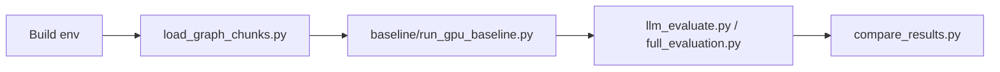

# MCP Layer: Build & Run Guide

Короткая инструкция по сборке окружения и запуску пайплайнов.

## 1) Сборка окружения

```bash
uv venv .venv
source .venv/Scripts/activate  # Windows Git Bash
uv pip install -r requirements.txt
```

`uv` automatically uses `.venv` in the current directory. No manual activation needed when using `uv run`.

Подготовка моделей Ollama:

```bash
ollama pull nomic-embed-text
ollama pull llama3.2:3b
ollama serve
```

При необходимости задайте ключ OpenAI:

```bash
export OPENAI_API_KEY=your_key
```

## 2) Порядок запуска



## 3) Индексация данных (`instructions` -> ClickHouse)

```bash
uv run python load_graph_chunks.py
```

Без пересоздания таблицы:

```bash
uv run python load_graph_chunks.py --no-force-recreate
```

## 4) Генерация baseline-ответов

```bash
uv run python baseline/run_gpu_baseline.py
```

Результат: `baseline/rag_answers_gpu.json`

## 5) Оценка качества

```bash
uv run python llm_evaluate.py --main <main.json> --hypothesis <hyp.json>
```

или полный прогон:

```bash
uv run python full_evaluation.py
```

## 6) Сравнение прогонов

```bash
uv run python compare_results.py --old <old.csv|old.json> --new <new.json>
```

## 7) Ключевые файлы

- `instructions/` — исходные документы
- `baseline/questions` — вопросы
- `baseline/golden_set.json` — эталон
- `baseline/rag_answers_gpu.json` — сгенерированные ответы
- `load_graph_chunks.py` — предобработка и загрузка чанков
- `baseline/run_gpu_baseline.py` — основной RAG пайплайн
