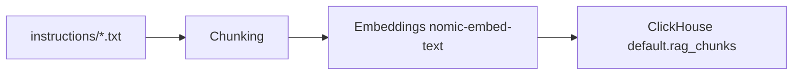
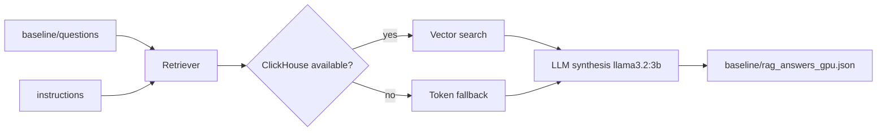
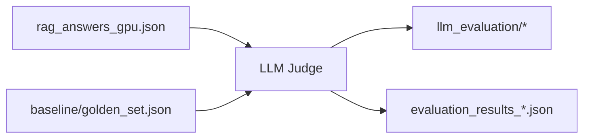
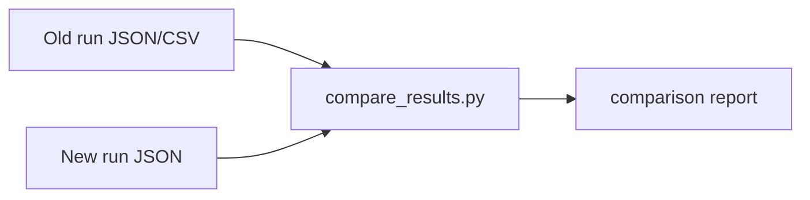

# MCP Layer: Pipeline Quickstart

Минимальная документация по запуску пайплайнов на данных из `instructions` и `baseline`.

## 1) Setup

```bash
pip install -r requirements.txt
ollama pull nomic-embed-text
ollama pull llama3.2:3b
ollama serve
```

Опционально для OpenAI-пайплайнов:

```bash
set OPENAI_API_KEY=your_key
```

## 2) Data Preprocessing Pipeline (Instructions -> ClickHouse)

Предзагрузка и индексация `instructions` в ClickHouse:

```bash
python load_graph_chunks.py
```

Без очистки таблицы:

```bash
python load_graph_chunks.py --no-force-recreate
```



## 3) Main Baseline Pipeline

Запуск генерации ответов:

```bash
python baseline/run_gpu_baseline.py
```

Результат:

- `baseline/rag_answers_gpu.json`



## 4) Evaluation Pipeline

Оценка качества LLM-судьей:

```bash
python llm_evaluate.py
```

Полный eval-контур:

```bash
python full_evaluation.py
```



## 5) Compare Runs

Сравнение двух прогонов:

```bash
python compare_results.py
```



## 6) Important Paths

- Data source: `instructions/`
- Questions: `baseline/questions`
- Golden set: `baseline/golden_set.json`
- Generated answers: `baseline/rag_answers_gpu.json`
- Main script: `baseline/run_gpu_baseline.py`
- Preprocessing script: `load_graph_chunks.py`
