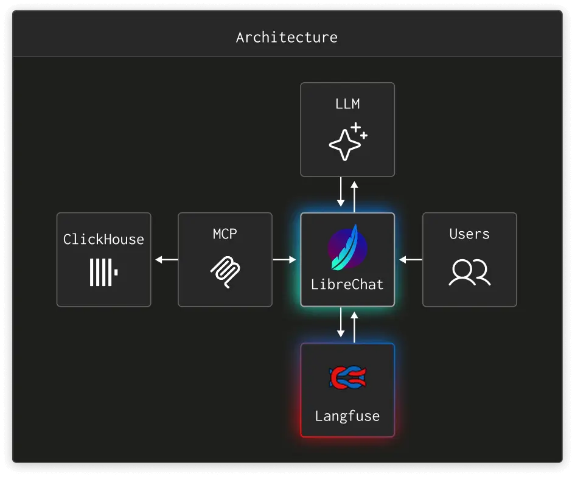

# Agentic Data Stack

The open-source stack for ClickHouse's suite of agentic analytic tools — your chat, your models, your data.  
Powered by [ClickHouse](https://clickhouse.com), [LibreChat](https://librechat.ai), and [Langfuse](https://langfuse.com).

> Learn more at [clickhouse.ai](https://clickhouse.ai)

## Overview

This project runs a fully self-hosted agentic analytics environment with Docker Compose. It connects a chat UI (LibreChat) to your data (ClickHouse) via MCP, with full LLM observability (Langfuse) — all in a single `docker compose up` command.

### What's included

| Component | Purpose | Port |
|---|---|---|
| **LibreChat** | Modern Chat UI with multi-model / provider support (OpenAI, Anthropic, Google) | `3080` |
| **ClickHouse MCP** | MCP server that gives agents access to ClickHouse | `8000` |
| **Langfuse** | LLM observability — traces, evals, prompt management | `3000` |
| **ClickHouse** | World's fastest analytical database | `8123` |
| **PostgreSQL** | Transactional database for Langfuse | `5432` |
| **MongoDB** | Transactional database for LibreChat | `27017` |
| **MinIO** | S3-compatible object storage | `9090` |
| **Redis** | Caching and queue | `6379` |
| **Meilisearch** | Full-text search for LibreChat | `7700` |
| **pgvector** | Vector database for RAG | `5433` |
| **RAG API** | Retrieval-augmented generation service for LibreChat | `8001` |

## Quick Start

### Prerequisites

- [Docker](https://docs.docker.com/get-docker/) and Docker Compose v2+

### 1. Prepare the environment

```bash
./scripts/prepare-demo.sh
```

This is your fastest way to get started with the Agentic Data Stack. It generates a `.env` file with random credentials for all services, then presents an interactive menu to optionally configure API keys for OpenAI, Anthropic, and/or Google. Any providers you skip will remain as `user_provided`, letting users enter their own keys in the LibreChat UI.

You can also generate credentials separately and customize the initial administrator account credentials:

```bash
USER_EMAIL="you@example.com" USER_PASSWORD="supersecret" USER_NAME="YourName" ./scripts/generate-env.sh
```

Learn more about configuring your LibreChat instance at https://librechat.ai/docs.

> **Note:** To use LibreChat's **file search / RAG** features, the RAG API needs a real API key for embeddings — `user_provided` won't work because the RAG API calls the embeddings endpoint directly. If `OPENAI_API_KEY` is set to `user_provided`, set `RAG_OPENAI_API_KEY` to a valid OpenAI key (it overrides `OPENAI_API_KEY` for RAG only). You can also switch embedding providers via `EMBEDDINGS_PROVIDER` (`openai`, `azure`, `huggingface`, `huggingfacetei`, `ollama`). See the [RAG API docs](https://librechat.ai/docs/configuration/rag_api) for details.

### 2. Start the stack

```bash
docker compose up -d
```

### 3. Access the services

- **LibreChat** — [http://localhost:3080](http://localhost:3080)
- **Langfuse** — [http://localhost:3000](http://localhost:3000)
- **MinIO Console** — [http://localhost:9091](http://localhost:9091) (Find credentials in `.env` under MINIO_ROOT_* fields)

An admin user is created automatically on first startup using the credentials from your `.env` file.

## Architecture



LibreChat connects to ClickHouse through the MCP server, allowing AI agents to query and analyze your data. All LLM interactions are traced in Langfuse for observability, evaluation, and prompt management.

## Scripts

| Script | Description |
|---|---|
| `scripts/prepare-demo.sh` | Generate `.env` and interactively configure API keys |
| `scripts/generate-env.sh` | Generate `.env` with random credentials |
| `scripts/reset-all.sh` | Stop all containers and wipe all data/volumes |
| `scripts/create-librechat-user.sh` | Manually create a LibreChat admin user |
| `scripts/init-librechat-user.sh` | Auto-init user on container startup (used internally) |

## Configuration

- **LibreChat** — `librechat.yaml` configures endpoints, MCP servers, and agent capabilities
- **Environment** — `.env` holds all credentials and service configuration (see `.env.example` for reference)
- **Docker** — `docker-compose.yml` includes the three compose files:
  - `langfuse-compose.yml` — Langfuse, ClickHouse, PostgreSQL, Redis, MinIO
  - `clickhouse-mcp-compose.yml` — ClickHouse MCP server
  - `librechat-compose.yml` — LibreChat, MongoDB, Meilisearch, pgvector, RAG API

## Reset Everything

To tear down all containers and delete all data:

```bash
./scripts/reset-all.sh
```

Then set up again and start fresh:

```bash
./scripts/prepare-demo.sh
docker compose up -d
```

## Links

- [clickhouse.ai](http://clickhouse.ai) — Project homepage
- [Documentation](https://clickhouse.com/docs/use-cases/AI/MCP/librechat) — Full setup guide for adding ClickHouse MCP to LibreChat
- [ClickHouse MCP](https://github.com/ClickHouse/mcp-clickhouse) — MCP server for ClickHouse
- [LibreChat](https://github.com/danny-avila/LibreChat) — Chat UI
- [Langfuse](https://langfuse.com) — LLM observability

## Alternative: Local RAG System (ClickHouse + Ollama)

This repository also includes an alternative Python-based RAG workflow focused on local inference with Ollama and vector search in ClickHouse (see `rag_system_alternative.py` and `ReadMe.txt`).

### Features

- Vector search using embeddings in ClickHouse
- Optional reranking for improved answer quality
- Query caching for faster repeated requests
- Multi-document PDF processing
- Benchmarking and export helpers (CSV/JSON/Parquet)

### Requirements

#### System

| Component | Minimum | Recommended |
|---|---|---|
| CPU | 4 cores | 8+ cores |
| RAM | 16 GB | 32+ GB |
| Disk | 10 GB | 20+ GB |
| GPU | Optional | NVIDIA 8 GB VRAM |

#### Software

- Python 3.10+
- ClickHouse (Cloud or local)
- Ollama installed locally

### Quick Start (Local RAG)

1. Install dependencies:

```bash
pip install clickhouse-connect ollama pypdf pandas numpy
pip install ipywidgets tqdm scikit-learn pyarrow
```

2. Install and start Ollama:

```bash
ollama pull nomic-embed-text
ollama pull llama3.2:3b
ollama serve
```

3. Configure ClickHouse credentials in your script or environment.

4. Run:

```bash
python rag_system_alternative.py
```

### Suggested Environment Variables (Local RAG)

```bash
# ClickHouse
CLICKHOUSE_HOST=your-host.clickhouse.cloud
CLICKHOUSE_USER=default
CLICKHOUSE_PASSWORD=your-password

# Ollama
EMBED_MODEL=nomic-embed-text
LLM_MODEL=llama3.2:3b

# RAG tuning
CHUNK_SIZE=1000
CHUNK_OVERLAP=150
TOP_K=8
NUM_CTX=4096
NUM_PREDICT=400
TEMPERATURE=0.1
```

## Generate `rag_answers_gpu.json` (Baseline RAG)

To produce question-answer pairs with the baseline RAG pipeline:

1. Ensure Ollama is running and models are available:
   - `ollama pull nomic-embed-text`
   - `ollama pull llama3.2:3b`
   - `ollama serve`
2. From the project root, run:
   - `python baseline/run_gpu_baseline.py`
3. The script reads questions from `baseline/questions`, performs retrieval over `instructions`, synthesizes answers with the LLM, and writes results to:
   - `baseline/rag_answers_gpu.json`
