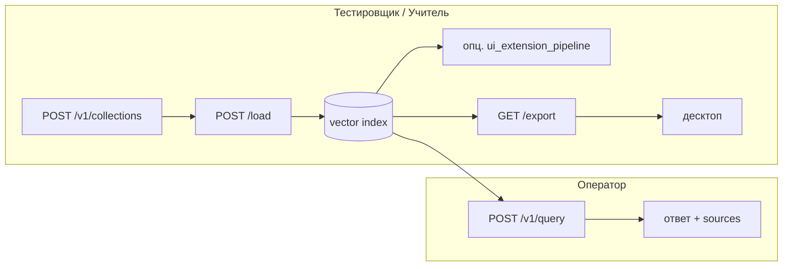

# COMPACS RAG Engine v2

Серверный RAG-стенд КОМПАКС® 7: загрузка документов → chunking + hybrid search (dense + BM25) → ответ LLM (Ollama/OpenAI) → единая точка входа **gateway** (UI + API). С хоста при Docker: **`http://localhost:3090`** (`RAG_GATEWAY_PORT`); внутри compose gateway слушает **`:3080`**, engine — **`:8080`** (`rag-compose.host-ollama.yml`).

## Содержание

1. [Что это](#1-что-это)
2. [Quick Start](#2-quick-start-рекомендуемый-путь)
3. [Проверка работоспособности](#3-проверка-работоспособности)
4. [Пользовательские сценарии (по ролям)](#4-пользовательские-сценарии-по-ролям)
5. [Взаимодействие с UI, вопросы и загрузка документов](#5-взаимодействие-с-ui-вопросы-и-загрузка-документов)
6. [Минимальные требования](#6-минимальные-требования)
7. [Конфигурация (`.env.rag`)](#7-конфигурация-envrag)
8. [Требования (подробно)](#8-требования-подробно)
9. [Тесты](#9-тесты)
10. [Troubleshooting](#10-troubleshooting)
11. [Архитектура и документация](#11-архитектура-и-документация)

---

## 1. Что это

COMPACS RAG Engine v2 — серверный контур КОМПАКС® 7 для наполнения базы знаний, проверки ответов и выгрузки vector index на офлайн-десктоп. Ingestion и индексация выполняются на `/load`; вопросы оператора — через чат UI или `POST /v1/query`; обучение и оценка — CLI-скриптами (`scripts/ui_extension_pipeline.py`, `full_evaluation.py`).

**Архитектура:** клиент → gateway (UI + прокси) → engine (RAG + индекс) → Ollama/OpenAI; индекс обновляется при загрузке документов, не на каждый запрос (`docs/CONTROLLER_PATTERN.md`, `docs/RAG_V2_API.md`).

---

## 2. Quick Start (рекомендуемый путь)

**Docker + Ollama на хосте** — не тянем образ `ollama/ollama` (~2 GB). Модели и inference на хосте; в контейнерах только engine + gateway.

Порт gateway с хоста = `RAG_GATEWAY_PORT` (в `.env.rag.docker.example` = **3090**). Внутри compose gateway слушает **:3080**.

### Шаг 1. Ollama на хосте

```bash
ollama serve
ollama pull llama3.2:3b
ollama pull nomic-embed-text
ollama run llama3.2:3b "ok"
```

Модели по умолчанию: `OLLAMA_MODEL=llama3.2:3b`, `EMBED_MODEL=nomic-embed-text` (`config.py:116`, `config.py:126`).

**Windows + Docker:** чтобы контейнер достучался до Ollama:

```powershell
powershell -ExecutionPolicy Bypass -File scripts/setup-ollama-docker-windows.ps1
```

### Шаг 2. Конфиг и запуск compose

```bash
cp .env.rag.docker.example .env.rag
docker compose -f rag-compose.host-ollama.yml up -d --build
```

Порты (`rag-compose.host-ollama.yml`):

| Сервис | С хоста | Внутри compose |
|--------|---------|----------------|
| **Gateway** (UI + API) | `http://localhost:3090` | `:3080` |
| **Engine** | только internal | `rag-engine:8080` |
| **Ollama** | `http://localhost:11434` | `host.docker.internal:11434` |

Маппинг: `${RAG_GATEWAY_PORT:-3080}:3080` — при `RAG_GATEWAY_PORT=3090` с хоста обращайтесь на **3090** (`rag-compose.host-ollama.yml:77`, `.env.rag.docker.example:44`).

Том `./data` монтируется в engine (`rag-compose.host-ollama.yml:48`).

### Шаг 3. Минимальный корпус и индекс

```bash
# тестовый файл
echo 'Кнопка «Новый документ» создаёт новый документ в интерфейсе оператора.' > /tmp/operator-note.txt

# папка (коллекция)
curl -s -X POST http://localhost:3090/v1/collections \
  -H "Content-Type: application/json" \
  -d '{"id": "demo", "name": "Demo"}'

# загрузка (синхронно)
curl -s -X POST "http://localhost:3090/load?collection_id=demo" \
  -F "file=@/tmp/operator-note.txt"
```

Поддерживаемые форматы: `.pdf`, `.txt`, `.md`, `.rst` (`core/ingestion.py:15-17`). ZIP не поддерживается.

### Шаг 4. Перейти к [проверке](#3-проверка-работоспособности)

---

<details>
<summary><strong>Альтернативные способы развёртывания</strong></summary>

### Полный Docker (Ollama в контейнере)

```bash
cp .env.rag.docker.example .env.rag
docker compose -f rag-compose.yml up -d --build
docker compose -f rag-compose.yml exec ollama ollama pull nomic-embed-text
docker compose -f rag-compose.yml exec ollama ollama pull llama3.2:3b
docker compose -f rag-compose.yml exec ollama ollama run llama3.2:3b "ok"
```

С хоста gateway также на `http://localhost:3090` при `RAG_GATEWAY_PORT=3090`. Volumes: `ollama_models`, `rag_data` (`rag-compose.yml:88-90`).

### Bare metal (без Docker)

```bash
cp .env.rag.example .env.rag
pip install -e .
python -m app serve
```

Без маппинга портов: gateway **`http://localhost:3080`**, engine `127.0.0.1:8080` (`app.py:52-71`).

Production:

```bash
gunicorn wsgi:app -c gunicorn.conf.py
python -m uvicorn api.stable:app_stable --host 127.0.0.1 --port 8080
```

### Индекс UI Extension (опционально)

```bash
python scripts/ui_extension_pipeline.py extract
python scripts/ui_extension_pipeline.py index
```

Подробнее: `docs/UI_EXTENSION.md`.

### LibreChat (опционально)

```bash
docker compose -f librechat-compose.yml up -d
```

Порт UI: `LIBRECHAT_PORT` (дефолт **3081**, `docs/RAG_V2_API.md`).

</details>

---

## 3. Проверка работоспособности

Порт gateway с хоста = `RAG_GATEWAY_PORT` (в `.env.rag.docker.example` = **3090**). Внутри compose gateway слушает **:3080**.

### Health

```bash
curl -s http://localhost:3090/health | jq .
```

Gateway агрегирует статус engine (`api/gateway.py:115-124`). Engine health **внутри compose** — `http://rag-engine:8080/health`; с хоста engine не опубликован (`rag-compose.host-ollama.yml:49-50`). Для bare metal / `docker exec`:

```bash
curl -s http://localhost:8080/health | jq .
```

Engine возвращает `storage`, `llm_provider`, `embedding_provider` (`api/stable.py:206-215`).

### Ollama

```bash
curl -s http://localhost:11434/api/tags | jq '.models[].name'
```

### Тестовый RAG-запрос

**Критерий успеха:** в ответе есть **непустой `answer`** и **массив `sources` с хотя бы одним элементом**. Пустой ответ → HTTP **500** (`api/stable.py:103-104`).

```bash
curl -s -X POST http://localhost:3090/v1/query \
  -H "Content-Type: application/json" \
  -d '{"question": "Что делает кнопка «Новый документ»?", "collection_ids": ["demo"]}' | jq '{answer: .answer[0:200], source_count: (.sources | length)}'
```

Ожидается `source_count >= 1` и непустой `answer`.

Другие демо-вопросы: [`docs/DEMO_QUESTIONS.md`](docs/DEMO_QUESTIONS.md).

### Прогрев модели (обязательно после холодного старта Ollama)

```bash
ollama run llama3.2:3b "ok"
```

Без прогрева первый запрос может занять **~50 с** только на загрузку весов (`.env.rag.docker.example:15`).

### SSE

```bash
curl -N -X POST http://localhost:3090/v1/query \
  -H "Content-Type: application/json" \
  -d '{"question": "Что делает кнопка «Новый документ»?", "stream": true, "collection_ids": ["demo"]}'
```

---

## 4. Пользовательские сценарии (по ролям)

Сквозные циклы по ролям. Все HTTP-вызовы с хоста — через **gateway** `http://localhost:3090` (`api/gateway.py` проксирует `/v1/*` в engine, `api/gateway.py:518-534`).

Порт gateway с хоста = `RAG_GATEWAY_PORT` (в `.env.rag.docker.example` = **3090**). Внутри compose gateway слушает **:3080**.

### 4.1. Таблица ролей

| Роль | Цель | Эндпоинты / скрипты |
|------|------|---------------------|
| **Оператор** | Задать вопрос по документации, получить ответ с источниками | UI `GET /` (`api/gateway.py:127`), `POST /api/chat` (`api/gateway.py:373`), `POST /v1/query` (`api/stable.py:90`) |
| **Тестировщик (Учитель)** | Наполнить базу, проверить качество, выгрузить на десктоп | `POST /v1/collections` (`api/collections.py:47`), `POST /load` (`api/gateway.py:408`), `GET /load/{job_id}` → `GET /v1/jobs/{id}` (`api/gateway.py:433`, `api/jobs.py:12`), `GET /sources` (`api/sources.py:35`), `POST /v1/query`, `DELETE /sources/{id}` (`api/sources.py:61`), `GET /export` (`api/stable.py:258`) |
| **Разработчик** | Пайплайн UI Extension, оценка golden, CI | `scripts/ui_extension_pipeline.py`, `full_evaluation.py`, `python -m app ingest` (`app.py:97`), `python -m pytest` |

Демо-вопросы для приёмки: [`docs/DEMO_QUESTIONS.md`](docs/DEMO_QUESTIONS.md).

### 4.2. Сценарий A — «Наполнение базы знаний»

**Роль:** Тестировщик / Учитель.  
**Цель:** загрузить корпус в коллекцию, дождаться индексации, проверить retrieval и убрать устаревший источник.

Подготовка (один раз):

```bash
echo 'Кнопка «Новый документ» создаёт новый документ в интерфейсе оператора.' > /tmp/operator-note.txt
```

#### Шаг 1 — создать коллекцию

**Зачем:** изолировать корпус по теме; путь источника будет `collections/{id}/...` (`api/collections.py:47-58`).

```bash
curl -s -X POST http://localhost:3090/v1/collections \
  -H "Content-Type: application/json" \
  -d '{"id": "ops-manual", "name": "Операторская"}'
```

**Критерий успеха:** HTTP 200, в теле `"id": "ops-manual"`.

#### Шаг 2 — загрузить документ фоном

**Зачем:** не блокировать gateway; ingestion в thread pool (`core/ingest_jobs.py:52-58`, `api/collections.py:134-142`). Поддерживаемые расширения: `.pdf`, `.txt`, `.md`, `.rst` (`core/ingestion.py:15-17`).

```bash
UPLOAD=$(curl -s -X POST "http://localhost:3090/load?collection_id=ops-manual&background=true" \
  -F "file=@/tmp/operator-note.txt")
echo "$UPLOAD" | jq .
JOB_ID=$(echo "$UPLOAD" | jq -r '.job_id')
```

**Критерий успеха:** HTTP **202**, в JSON есть `job_id` и `poll_url` (`api/gateway.py:429`, `api/collections.py:136-141`).

#### Шаг 3 — дождаться индексации

**Зачем:** poll статуса job до `completed` (`core/ingest_jobs.py:20-21`).

```bash
curl -s "http://localhost:3090/load/${JOB_ID}"
```

**Критерий успеха:** `"status": "completed"`, `error` отсутствует (`core/ingest_jobs.py:35-44`). При `"status": "failed"` — смотреть поле `error`.

#### Шаг 4 — проверить источники

**Зачем:** убедиться, что файл попал в индекс и виден в UI/API.

```bash
curl -s "http://localhost:3090/sources?format=json" | jq '{count, sources: [.sources[] | {id, filename, chunk_count, collection_id}]}'
```

**Критерий успеха:** `count >= 1`, у записи `collection_id == "ops-manual"`, `chunk_count > 0` (`api/sources.py:22-42`).

#### Шаг 5 — проверить качество вопросом

**Зачем:** end-to-end RAG: retrieval + генерация (`api/stable.py:90-115`).

```bash
curl -s -X POST http://localhost:3090/v1/query \
  -H "Content-Type: application/json" \
  -d '{"question": "Что делает кнопка «Новый документ»?", "collection_ids": ["ops-manual"]}' \
  | jq '{answer: .answer[0:200], source_count: (.sources | length)}'
```

**Критерий успеха:** непустой `answer`, `source_count >= 1`; пустой ответ → HTTP 500 (`api/stable.py:103-104`).

#### Шаг 6 — удалить устаревший источник

**Зачем:** убрать документ и переиндексировать vector store (`api/sources.py:61-68`, `core/sources.py:117-130`).

```bash
SOURCE_ID=$(curl -s "http://localhost:3090/sources?format=json" | jq -r '.sources[] | select(.collection_id=="ops-manual") | .id' | head -1)
curl -s -X DELETE "http://localhost:3090/sources/${SOURCE_ID}" | jq .
```

**Критерий успеха:** `"reindexed": true`, `"deleted": "<source_id>"` (`core/sources.py:125`, `core/sources.py:130`). Повторный `GET /sources` — источник исчез.

---

### 4.3. Сценарий B — «Цикл обучения / дообучения локальной модели»

**Роль:** Тестировщик / Разработчик.  
**Цель:** подготовить корпус UI Extension → индекс → (опц.) QA-пары → Modelfile + `ollama create` → оценка.

Пайплайн: `scripts/ui_extension_pipeline.py` (`scripts/ui_extension_pipeline.py:2`, подкоманды `scripts/ui_extension_pipeline.py:439-456`).

| Шаг | Команда | Артефакт |
|-----|---------|----------|
| extract | `python scripts/ui_extension_pipeline.py extract` | `instructions/ui_extension/` (`scripts/ui_extension_pipeline.py:25`) |
| index | `python scripts/ui_extension_pipeline.py index` | `data/vectors/chunks.json` (`scripts/ui_extension_pipeline.py:26`) |
| generate-qa | `python scripts/ui_extension_pipeline.py generate-qa` | `instructions/golden/ui_extension_qa_150.json` (`scripts/ui_extension_pipeline.py:27`) |
| finetune | `python scripts/ui_extension_pipeline.py finetune --ollama-only` | `data/finetune/Modelfile.compacs-ui-ft`, модель `compacs-ui-ft` (`scripts/ui_extension_pipeline.py:29-30`, `scripts/ui_extension_pipeline.py:284-290`) |
| evaluate (pipeline) | `python scripts/ui_extension_pipeline.py evaluate` | сравнение baseline vs `compacs-ui-ft` (`scripts/ui_extension_pipeline.py:453-456`) |

Пример полного цикла (bare metal, Ollama на хосте):

```bash
python scripts/ui_extension_pipeline.py extract
python scripts/ui_extension_pipeline.py index
python scripts/ui_extension_pipeline.py finetune --ollama-only --train-qa-path instructions/golden/ui_extension_qa_150.json
```

Оценка на golden (офлайн-судья Ollama):

```bash
python full_evaluation.py \
  --golden instructions/golden/ui_extension_qa_150.json \
  --llm-provider ollama \
  --llm-judge \
  --judge-backend ollama
```

Судья Ollama: `full_evaluation.py:599-603`. Дефолт judge — `openai` (`full_evaluation.py:517-519`).

#### Ограничение офлайн-режима: `generate-qa`

`generate-qa` вызывает **OpenAI GPT** как «учителя» и **требует** `OPENAI_API_KEY` в `.env.rag`:

```text
OPENAI_API_KEY required in .env.rag for QA generation
```

(`scripts/ui_extension_pipeline.py:167-169`, модель `gpt-4o-mini` — `scripts/ui_extension_pipeline.py:189-190`).

**В офлайн-контуре без ключа шаг `generate-qa` недоступен.**

| Обход | Описание |
|-------|----------|
| `finetune --ollama-only` | Только Modelfile + `ollama create`; OpenAI FT пропускается (`scripts/ui_extension_pipeline.py:295-296`, `scripts/ui_extension_pipeline.py:305-307`) |
| Готовый QA JSON | Положить пары в `instructions/golden/ui_extension_qa_150.json` и вызвать `finetune --train-qa-path ...` |
| Judge на Ollama | `full_evaluation.py --judge-backend ollama` (см. выше) |
| **TODO** | Локальный «учитель» на Ollama для `generate-qa` — **нет в коде** (`scripts/ui_extension_pipeline.py:159-197` использует только `OpenAI`) |

`ui_extension_pipeline.py evaluate --llm-judge` подключает судью **только через OpenAI** (`scripts/ui_extension_pipeline.py:354-360`); для офлайн-судьи используйте `full_evaluation.py`.

После `finetune` модель `compacs-ui-ft` остаётся в Ollama на сервере; **экспорт весов на десктоп через API не реализован** — см. сценарий C.

---

### 4.4. Сценарий C — «Выгрузка на десктоп»

**Роль:** Тестировщик / Разработчик.  
**Цель:** передать vector index офлайн-клиенту после наполнения (и опционально обучения).

#### Шаг 1 — убедиться, что индекс не пуст

```bash
curl -s "http://localhost:3090/sources?format=json" | jq '.count'
```

**Критерий успеха:** `count > 0`.

#### Шаг 2 — экспорт JSONL

**Зачем:** единственный контракт синхронизации с десктопом в v2 (`docs/TECHNICAL_NOTE_V2.md:93-95`).

```bash
curl -f -OJ http://localhost:3090/export
```

Gateway проксирует в `GET /v1/export?format=jsonl` (`api/gateway.py:487-490`, `api/stable.py:258-269`).

**Критерий успеха:** скачан файл `compacs-vectors-*.jsonl`, HTTP 200. Пустой индекс → **404** `vector index is empty` (`api/stable.py:264-265`).

#### Шаг 3 — импорт в офлайн-клиент

Пошаговый сценарий: [`docs/DESKTOP_QUICKSTART.md`](docs/DESKTOP_QUICKSTART.md).

| Что переносится | Статус в коде |
|-----------------|---------------|
| Vector index (JSONL, dim **768** для `nomic-embed-text`) | `GET /export` (`api/stable.py:258`) |
| Веса LLM / GGUF / `compacs-ui-ft` | **Не через `/export`** (`docs/TECHNICAL_NOTE_V2.md:95`) — **TODO:** отдельная поставка; экспорт модели в API отсутствует |
| Формат `.bin`/`.db` | **TODO** (`docs/TECHNICAL_NOTE_V2.md:127`) |

---

### 4.5. Диаграмма циклов



---

## 5. Взаимодействие с UI, вопросы и загрузка документов

Порт gateway с хоста = `RAG_GATEWAY_PORT` (в `.env.rag.docker.example` = **3090**). Внутри compose gateway слушает **:3080**.

### Коллекции, загрузка, источники, export

| Действие | Endpoint |
|----------|----------|
| Создать папку | `POST /v1/collections` |
| Список папок | `GET /v1/collections` |
| Scope поиска | `PUT /v1/collections/selection` |
| Загрузка (UI) | `POST /load?collection_id=...` |
| Загрузка (API) | `POST /v1/collections/{id}/documents` |
| Фоновая индексация | `?background=true` → poll `GET /v1/jobs/{job_id}` |
| Источники | `GET /sources?format=json` |
| Скачать оригинал | `GET /sources/{id}/download` |
| Удалить источник | `DELETE /sources/{id}` |
| **Export для десктопа** | `GET /export` → JSONL |

```bash
curl -s -X POST http://localhost:3090/v1/collections \
  -H "Content-Type: application/json" \
  -d '{"id": "ops-manual", "name": "Операторская"}'

curl -s -X POST "http://localhost:3090/load?collection_id=ops-manual&background=true" \
  -F "file=@manual.pdf"

curl -s "http://localhost:3090/sources?format=json" | jq '.sources | length'

curl -f -OJ http://localhost:3090/export
```

Скрипт-пример: `python scripts/demo_upload_http.py` (нужен файл `data/demo_upload/operator_note.txt`; в скрипте захардкожен `http://127.0.0.1:3080` — при Docker подставьте **3090**).

Десктопный сценарий: [`docs/DESKTOP_QUICKSTART.md`](docs/DESKTOP_QUICKSTART.md).  
Полное API: [`docs/COLLECTIONS_API.md`](docs/COLLECTIONS_API.md).

### Вопросы

**UI:** http://localhost:3090 — чат (`POST /api/chat`, SSE).

**API:**

```bash
curl -s -X POST http://localhost:3090/v1/query \
  -H "Content-Type: application/json" \
  -d '{"question": "Как открыть справку по текущему окну?", "collection_ids": ["ops-manual"]}'
```

Scope: поле `collection_ids` в теле запроса (`api/stable.py:78`, `api/stable.py:96`).

---

## 6. Минимальные требования

| Ресурс | Ориентир |
|--------|----------|
| **Диск** | ~**8–12 GB** (модели Ollama ~2.3 GB + образы + индекс) |
| **RAM** | **≥ 8 GB** |
| **ПО** | Docker + Compose, Ollama на хосте или в контейнере, Python ≥ 3.10 для CLI/тестов |

GPU необязателен. Подробные таблицы ПО / диск / RAM с источниками и TODO — в [§8](#8-требования-подробно).

---

## 7. Конфигурация (`.env.rag`)

Скопируйте шаблон:

- **Docker:** `.env.rag.docker.example` → `.env.rag`
- **Bare metal:** `.env.rag.example` → `.env.rag`

Переменные из **`.env.rag.docker.example`** (полный список файла):

| Переменная | Значение в примере | Назначение |
|------------|-------------------|------------|
| `STORAGE_BACKEND` | `json` | Бэкенд vector store (`config.py:92`) |
| `LOCAL_VECTOR_STORE_DIR` | `/app/data/vectors` | Путь к индексу в контейнере |
| `INSTRUCTIONS_DIR` | `/app/instructions` | Исходники для CLI ingest |
| `LLM_PROVIDER` | `ollama` | Провайдер генерации |
| `LLM_FALLBACK_ENABLED` | `false` | Fallback на другой LLM |
| `EMBEDDING_PROVIDER` | `ollama` | Провайдер эмбеддингов |
| `EMBEDDING_FALLBACK_ENABLED` | `false` | Fallback эмбеддингов |
| `OLLAMA_HOST` | `http://ollama:11434` | URL Ollama (в host-ollama compose переопределяется) |
| `OLLAMA_MODEL` | `llama3.2:3b` | LLM |
| `EMBED_MODEL` | `nomic-embed-text` | Модель эмбеддингов |
| `OLLAMA_KEEP_ALIVE` | `30m` | Держать модель в RAM |
| `OLLAMA_CLIENT_TIMEOUT` | `300` | Таймаут клиента к Ollama |
| `NUM_CTX` | `8192` | Контекстное окно |
| `NUM_PREDICT` | `400` | Лимит генерации (токены) |
| `OPENAI_API_KEY` | *(пусто)* | Ключ OpenAI |
| `OPENAI_MODEL` | `gpt-4o-mini` | Модель OpenAI (если включён) |
| `MAX_TOKENS` | `600` | Лимит для OpenAI-пути |
| `CHUNK_SIZE` | `1000` | Размер чанка |
| `CHUNK_OVERLAP` | `150` | Перекрытие чанков |
| `TOP_K` | `12` | Кандидаты retrieval |
| `RERANK_TOP_K` | `3` | Чанки в промпте LLM |
| `OLLAMA_CONTEXT_CHUNKS` | `3` | Чанки для Ollama-контекста |
| `OLLAMA_CHUNK_CHARS` | `350` | Обрезка чанка в промпте |
| `SIMILARITY_THRESHOLD` | `0.35` | Порог similarity |
| `CACHE_ENABLED` | `true` | Кэш ответов |
| `CACHE_TTL` | `3600` | TTL кэша (с) |
| `COMPACS_API_KEY` | `compacs-local-dev-key` | Ключ LibreChat / `/v1/chat/completions` |
| `COMPACS_MODELS` | `compacs-rag` | Имена моделей в API |
| `COMPACS_PRO_KEY` | *(пусто)* | Ключ pro-режима |
| `RAG_GATEWAY_PORT` | `3090` | Порт gateway **с хоста** (внутри контейнера — `:3080`) |

**Не в docker-примере, но важно для production** (есть в `.env.rag.example` и compose):

| Переменная | Дефолт | Назначение |
|------------|--------|------------|
| `GATEWAY_TIMEOUT` | `300` | Gunicorn + proxy (`gunicorn.conf.py:11`) |
| `GATEWAY_WORKERS` | CPU count | Воркеры gateway (`gunicorn.conf.py:10`) |
| `GATEWAY_BIND` | `0.0.0.0:3080` | Адрес **внутри** контейнера gateway (`rag-compose.host-ollama.yml:73`) |
| `RAG_ENGINE_URL` | `http://rag-engine:8080` | URL engine **из** gateway-контейнера (`rag-compose.host-ollama.yml:72`) |

Дополнительные переменные bare metal (hybrid search, judge): см. `.env.rag.example`.

### Офлайн-профиль (рекомендуемый режим стенда)

Без OpenAI — как в `.env.rag.docker.example`:

```env
OPENAI_API_KEY=
LLM_PROVIDER=ollama
LLM_FALLBACK_ENABLED=false
EMBEDDING_PROVIDER=ollama
EMBEDDING_FALLBACK_ENABLED=false
OLLAMA_MODEL=llama3.2:3b
EMBED_MODEL=nomic-embed-text
```

Размерность индекса: **768** (`core/embedding_alignment.py:13`). Для OpenAI-индекса нужен ключ и **1536** — см. [Troubleshooting](docs/TROUBLESHOOTING.md#смена-провайдера-эмбеддингов-без-переиндексации).

---

## 8. Требования (подробно)

### ПО

| Компонент | Версия | Источник |
|-----------|--------|----------|
| **Python** | ≥ 3.10 (образ Docker: **3.11-slim**) | `pyproject.toml:5`, `Dockerfile:2` |
| **Docker + Compose** | TODO: минимальная версия не зафиксирована в репозитории | — |
| **Ollama** (сервер) | TODO: минимальная версия не зафиксирована; Python-клиент `ollama>=0.3.0` | `pyproject.toml:10` |
| **GPU** | Необязателен; стенд рассчитан на CPU + `llama3.2:3b` | `config.py:116` |

### Диск (ориентиры)

| Что | Размер | Источник |
|-----|--------|----------|
| `llama3.2:3b` | **2.0 GB** | `ollama pull` / `ollama list` |
| `nomic-embed-text` | **274 MB** | `ollama list` |
| Модели Ollama **итого** | **~2.3 GB** | сумма выше |
| Образ `ollama/ollama` (только полный compose) | **~2 GB** pull | `rag-compose.host-ollama.yml:1` |
| Образы `compacs-rag-engine` + `compacs-rag-gateway` | **TODO:** после `docker compose build` смотреть `docker images` | `Dockerfile` |
| Vector index `data/vectors/` | зависит от корпуса | volume `./data` или `rag_data` |

**Рекомендуемый запас на диск:** ~**8–12 GB** (модели + образы + индекс + логи). Точный минимум для вашей сборки — TODO после первого `docker compose build`.

### RAM

| Что | Ориентир | Источник |
|-----|----------|----------|
| `llama3.2:3b` в RAM при инференсе | **TODO:** точное значение не задокументировано в repo; ориентир **3–4 GB** для 3.2B | параметры модели в `ollama show`; cold load ~50 с — `.env.rag.docker.example:15` |
| Engine + gateway (2 контейнера) | **TODO** | — |
| **Итого для комфортной работы** | **≥ 8 GB RAM** (оценка) | TODO: замерить на целевой VM |

---

## 9. Тесты

```bash
pip install -e ".[dev]"

# Unit + integration (~32 файла в tests/)
python -m pytest tests/unit tests/integration -q

# Smoke: нужны chunks.json + Ollama
python scripts/smoke_rag.py
python scripts/smoke_rag.py --stream
python scripts/smoke_rag.py -q "Что делает кнопка «Новый документ»?"

# Golden evaluation (офлайн: ollama + judge ollama)
python full_evaluation.py --golden baseline/golden_set.json --llm-provider ollama
python full_evaluation.py --golden baseline/golden_set.json --llm-provider ollama --llm-judge --judge-backend ollama

# Дрейф / метрики
python scripts/monitor_data_drift.py --preset splits
curl -s "http://localhost:3090/metrics?format=json" | jq .
```

`full_evaluation.py`: дефолт LLM — `ollama` (`full_evaluation.py:503`), дефолт judge — `openai` (`full_evaluation.py:519`); для офлайн-судьи явно `--judge-backend ollama`.

---

## 10. Troubleshooting

Краткий указатель — ниже. Подробно: **[`docs/TROUBLESHOOTING.md`](docs/TROUBLESHOOTING.md)**.

| Симптом | Куда смотреть |
|---------|----------------|
| Источники есть, ответ пустой / таймаут | Прогрев, `GATEWAY_TIMEOUT=300`, `OLLAMA_KEEP_ALIVE=30m` |
| Смена embed-провайдера | **Переиндексация:** `python -m app ingest --force-reload` |
| EN-вопрос к RU-корпусу | Кросс-язычный retrieval, не таймаут |
| Export 404 | Индекс пуст |
| Windows + Docker | `scripts/setup-ollama-docker-windows.ps1` |

---

## 11. Архитектура и документация

Клиент (браузер, curl, десктоп) обращается к **gateway** с хоста на **`http://localhost:3090`** (`RAG_GATEWAY_PORT`). Gateway внутри контейнера слушает **`:3080`** и проксирует в **engine `:8080`** (`RAG_ENGINE_URL=http://rag-engine:8080`); engine читает vector index и вызывает Ollama/OpenAI. Индекс обновляется на `/load`, а не на каждый `POST /v1/query` (`docs/CONTROLLER_PATTERN.md`).

### Что читать в `docs/`

| Документ | Содержание |
|----------|------------|
| [`TECHNICAL_NOTE_V2.md`](docs/TECHNICAL_NOTE_V2.md) | Production scope, TBD, связь с десктопом |
| [`RAG_V2_API.md`](docs/RAG_V2_API.md) | Маршруты gateway/engine, LibreChat |
| [`CONTROLLER_PATTERN.md`](docs/CONTROLLER_PATTERN.md) | Два стрима: данные + инференс |
| [`COLLECTIONS_API.md`](docs/COLLECTIONS_API.md) | Collections, upload, export |
| [`DEMO_QUESTIONS.md`](docs/DEMO_QUESTIONS.md) | Вопросы для приёмки |
| [`DESKTOP_QUICKSTART.md`](docs/DESKTOP_QUICKSTART.md) | Сервер → export → офлайн-клиент |
| [`TROUBLESHOOTING.md`](docs/TROUBLESHOOTING.md) | Диагностика и фиксы |
| [`UI_EXTENSION.md`](docs/UI_EXTENSION.md) | Пайплайн UI Extension, Modelfile |

Пакет Python: `rag-system` v0.1.0 (`pyproject.toml:2-3`).
