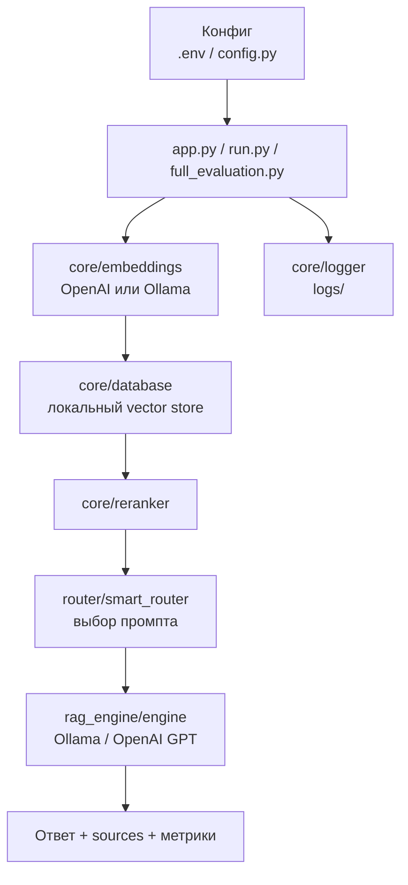
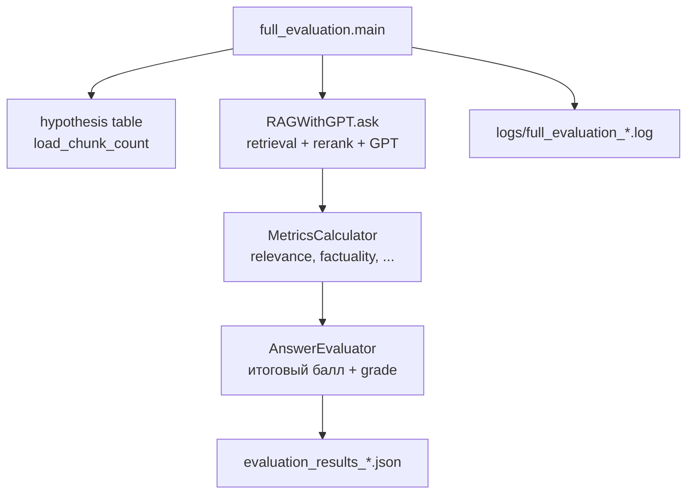

# RAG System — база знаний и оценка ответов

Python-модуль для индексации документации, ответов на вопросы через RAG (локальное векторное хранилище + LLM) и сравнительной оценки качества ответов (эвристики, Ollama, OpenAI).

## Что делает модуль

- Индексирует документы (PDF, TXT, MD, RST) в локальное JSON-векторное хранилище (`data/vector_store/`).
- Строит графовый датасет из `doc-2.0-sources` (пары `questions.txt` + `answer.txt`) для Q&A-индексации.
- Отвечает на вопросы через RAG: эмбеддинги → поиск → rerank → выбор системного промпта → генерация (Ollama или OpenAI GPT).
- Поддерживает две логические таблицы в хранилище: **main** (основная база) и **hypothesis** (экспериментальная).
- Запускает полную оценку на фиксированном наборе вопросов (`full_evaluation.py`): метрики, итоговый балл, экспорт JSON.
- Сравнивает старые и новые результаты оценки (`compare_results.py`).
- Оценивает ответы через LLM-судью: Ollama (`llm_evaluate.py`) или OpenAI (`llm_evaluate_percent.py`).
- Ведёт структурированные логи запусков (`logs/`) и аудит пайплайна (`answer_and_audit.py`).
- Опционально применяет HTTP-сервис предобработки текста (baseline / experiment) перед индексацией.

## Архитектура

Проект организован в 4 основных пакета:

| Пакет | Назначение |
|-------|------------|
| `core/` | Векторное хранилище, эмбеддинги, ingestion, PDF, reranker, логирование, предобработка |
| `rag_engine/` | Основной RAG-пайплайн (`ask`) |
| `router/` | Выбор и обогащение системного промпта, few-shot примеры |
| `evaluator/` | Загрузка Q&A, сканирование папок, анализ результатов |

Точки входа (CLI-скрипты):

| Скрипт | Назначение |
|--------|------------|
| `app.py` | Единый CLI: ingest, pipeline, query, evaluate, judge, chat |
| `run.py` | Классический CLI: загрузка документов, интерактив, оценка |
| `full_evaluation.py` | Полная оценка RAG + GPT на бенчмарке |
| `build_graph_dataset.py` | Сборка `graph_index.json` и `graph_chunks.jsonl` |
| `load_graph_chunks.py` | Загрузка графовых чанков в hypothesis-таблицу |
| `answer_and_audit.py` | Ответы + аудит логов |
| `compare_results.py` | Сравнение двух прогонов оценки |
| `llm_evaluate.py` | LLM-судья через Ollama (проценты) |
| `llm_evaluate_percent.py` | LLM-судья через OpenAI |

## Требования

- Python **3.10+**
- [uv](https://github.com/astral-sh/uv) (рекомендуется) или `pip` + venv
- Для локальной генерации: **Ollama** с моделями эмбеддингов и LLM
- Для GPT-оценки и эмбеддингов OpenAI: **`OPENAI_API_KEY`**

## Установка

```bash
cd agentic-data-stack
uv sync
```

Скопируйте переменные окружения (минимум для RAG):

```bash
cp .env.example .env
# Заполните OPENAI_API_KEY и при необходимости EMBED_MODEL / LLM_MODEL
```

## Переменные окружения

Чувствительные и runtime-параметры задаются через `.env` или экспорт в shell.

### OpenAI

| Переменная | Описание |
|------------|----------|
| `OPENAI_API_KEY` | Ключ API OpenAI (эмбеддинги, GPT-ответы, LLM-судья) |
| `OPENAI_EMBEDDING_MODEL` | Модель эмбеддингов; по умолчанию `text-embedding-3-small` |
| `OPENAI_MODEL` | Модель чата для RAG/GPT; по умолчанию `gpt-4o-mini` |
| `MAX_TOKENS` | Лимит токенов ответа GPT; по умолчанию `800` |

### Ollama (локальная генерация и судья)

| Переменная | Описание |
|------------|----------|
| `EMBED_MODEL` | Модель эмбеддингов Ollama; по умолчанию `nomic-embed-text` |
| `LLM_MODEL` | Модель генерации; по умолчанию `llama3.2:3b` |

### RAG / retrieval

| Переменная | По умолчанию | Описание |
|------------|--------------|----------|
| `CHUNK_SIZE` | `1000` | Размер чанка при разбиении |
| `CHUNK_OVERLAP` | `150` | Перекрытие чанков |
| `TOP_K` | `8` | Число кандидатов из векторного поиска |
| `RERANK_TOP_K` | `3` | Число чанков после rerank |
| `SIMILARITY_THRESHOLD` | `0.35` | Порог схожести |
| `BATCH_SIZE` | `32` | Размер батча эмбеддингов |
| `MAX_TEXT_LENGTH` | `3072` | Макс. длина текста для эмбеддинга |
| `CACHE_ENABLED` | `true` | Кэш эмбеддингов |
| `CACHE_TTL` | `3600` | TTL кэша (сек) |

### Генерация (Ollama)

| Переменная | По умолчанию |
|------------|--------------|
| `NUM_CTX` | `4096` |
| `NUM_PREDICT` | `400` |
| `TEMPERATURE` | `0.1` |
| `TOP_P` | `0.9` |
| `REPEAT_PENALTY` | `1.1` |

Пути к данным задаются в `config.py` относительно корня проекта: `doc-2.0-sources/`, `data/vector_store/`, `data/few_shot_examples/`, `data/results/`.

> Файл `.env.example` в репозитории также содержит переменные для смежного стека (Langfuse, LibreChat, ClickHouse). Для **только RAG-модуля** достаточно ключей из таблиц выше.

## Примеры запуска

### 1. Единый CLI (`app.py`)

```bash
# Индексация папки с документами
uv run python app.py ingest --input-dir ./doc-2.0-sources --force-reload -v

# Графовый пайплайн (после build_graph_dataset.py)
uv run python app.py pipeline --profile graph -v

# Один вопрос
uv run python app.py query --question "What is a merchant control key?"

# Интерактивный режим
uv run python app.py chat

# Оценка на Q&A-парах из doc-2.0-sources
uv run python app.py evaluate --max-questions 10

# LLM-судья: сравнение main vs hypothesis
uv run python app.py judge --mode pairwise \
  --main-file answers_main.json \
  --hyp-file answers_hypothesis.json \
  --output data/results/judge_report.json
```

### 2. Классический CLI (`run.py`)

```bash
uv run python run.py --load-only          # только загрузка
uv run python run.py --query "..."        # один вопрос
uv run python run.py --evaluate           # оценка Q&A
uv run python run.py --force-reload -v    # пересоздать индекс и загрузить
```

### 3. Графовый датасет и hypothesis

```bash
# Сборка graph_index.json + graph_chunks.jsonl
uv run python build_graph_dataset.py --docs-dir ./doc-2.0-sources --out-dir ./data -v

# Загрузка чанков в hypothesis-таблицу
uv run python load_graph_chunks.py

# Полная оценка (RAG + GPT + метрики)
uv run python full_evaluation.py -v --output evaluation_results.json
```

### 4. Сравнение прогонов

```bash
uv run python compare_results.py \
  --old "evaluation_results_*.json" \
  --new evaluation_results_latest.json
```

### 5. Сервис предобработки (опционально)

```bash
# Терминал 1 — baseline на :8080
uv run python app.py preprocess-server --port 8080

# Терминал 2 — индексация с предобработкой
uv run python app.py ingest --preprocess-url http://127.0.0.1:8080/clean -v
```

## Сборка и проверки качества

```bash
# Линтер
uv run ruff check .

# Статическая типизация
uv run mypy .

# Тесты
uv run pytest -q
uv run pytest -v                  # подробный вывод
uv run pytest tests/test_full_evaluation.py -v   # один файл
```

Сейчас в проекте **19** автотестов (`tests/`).

## Поток выполнения (RAG-запрос)



## Поток полной оценки (`full_evaluation.py`)



## Структура данных (выходные артефакты)

| Путь | Содержимое |
|------|------------|
| `data/vector_store/` | JSON-файлы чанков и эмбеддингов (main / hypothesis) |
| `data/graph_index.json` | Индекс директория → вопросы → ответ |
| `data/graph_chunks.jsonl` | Чанки для графовой индексации |
| `logs/` | Структурированные логи запусков |
| `data/results/` | Отчёты judge, сравнения |
| `evaluation_results_*.json` | Результаты full_evaluation |
| `comparison/` | CSV/JSON сравнения прогонов |
| `llm_evaluation/` | Отчёты Ollama-судьи |

Эти каталоги перечислены в `.gitignore` (могут содержать PII, промпты, ключи в логах).

## Стандарты кода

См. [`AGENTS_PYTHON.md`](AGENTS_PYTHON.md) — правила логирования, типизации, обработки ошибок и CLI.

## Диагностика

```bash
# Состояние векторного хранилища
uv run python check_table.py -v

# Очистка хранилища
uv run python clean_all.py -v

# Аудит логов без полного прогона RAG
uv run python answer_and_audit.py --audit-only
```
