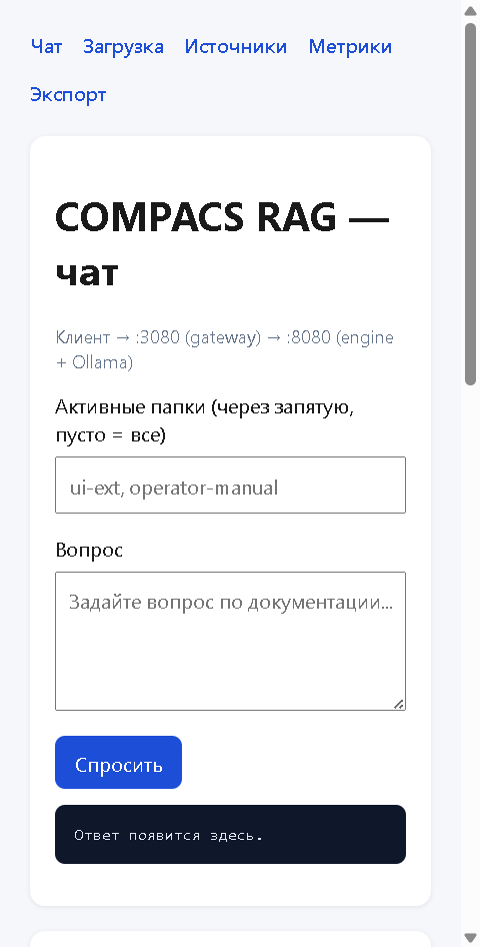

# Руководство пользователя COMPACS RAG (v2)

Веб-интерфейс для загрузки документации, индексации в векторную базу и диалога с ИИ по вашим PDF/TXT.

**Адрес UI:** http://localhost:3080  
**Версия стенда:** RAG Gateway (:3080) → Engine (:8080) → Ollama / OpenAI

---

## Навигация

| Вкладка | Назначение |
|---------|------------|
| **Чат** | Вопросы и ответы по проиндексированным документам |
| **Загрузка** | Создание папок, загрузка файлов, индексация |
| **Источники** | Список документов в индексе, удаление, полная очистка |
| **Метрики** | Число чанков, папок, служебная статистика |
| **Экспорт** | Выгрузка векторного индекса (JSONL) |


---

## Предварительные условия

1. Запущен стенд (`python -m app serve` или Docker `rag-compose`).
2. Доступен Ollama с моделями `llama3.2:3b` и `nomic-embed-text` (или настроен OpenAI в `.env.rag`).
3. Браузер открывает http://localhost:3080 без ошибок на `/health`.

Первый запрос после простоя Ollama может занять **до ~50 с** (холодная загрузка модели в RAM).

---

# Сценарий 1. Загрузка и индексация документов

Цель: положить PDF/текст в тематическую **папку (коллекцию)** и дождаться, пока файл разобьётся на чанки, получит эмбеддинги и попадёт в `data/vectors/chunks.json`.

## Шаг 1. Откройте блок «Загрузка»

На главной странице прокрутите до раздела **«Загрузка документов»** или перейдите по ссылке **Загрузка** в меню (`/#load`).



## Шаг 2. Создайте папку (коллекцию)

1. В блоке **«Новая папка»** укажите:
   - **ID** — латиница, например `ops-manual`, `demo-upload`;
   - **Название** — понятное имя, например «Операторская документация».
2. Нажмите **«Создать папку»**.
3. Внизу в логе появится сообщение вида: `Папка создана: ops-manual. Выберите файл и нажмите «Загрузить».`

Папка физически создаётся в `data/collections/<id>/files/`.

## Шаг 3. (Опционально) Ограничьте поиск по папкам

В блоке **«Выбор папок для RAG»** отметьте одну или несколько папок и нажмите **«Применить выбор»**.  
Если ничего не выбрано — чат ищет по **всему** индексу.

## Шаг 4. Загрузите файл

1. В списке **«Папка для загрузки»** выберите нужную коллекцию.
2. Нажмите **«Файл»** и выберите документ на диске.
3. Нажмите **«Загрузить»**.

**Поддерживаемые форматы:** `.pdf`, `.txt`, `.md`, `.rst`.  
**ZIP не поддерживается** — распакуйте архив и загружайте файлы по одному.

Индексация запускается **в фоне** (`background=true`). Интерфейс не «зависает», статус обновляется в чёрном поле лога внизу блока.

## Сколько ждать

Ориентиры для локального стенда с Ollama на CPU (модель `llama3.2:3b`):

| Тип файла | Объём | Ориентир времени индексации |
|-----------|-------|-----------------------------|
| TXT / MD | до 50 КБ | 5–20 с |
| PDF | 1–3 МБ, 10–30 стр. | 30 с – 2 мин |
| PDF | 5–15 МБ, 100+ стр. | 3–10 мин |
| Несколько крупных PDF подряд | суммарно 50+ МБ | 15–40+ мин |

Факторы: скорость диска, загрузка CPU, очередь Ollama на эмбеддинги, число страниц и чанков.

> Не закрывайте вкладку браузера сразу после «Загрузить» — дождитесь финального статуса в логе.

## Как понять, что документ «переварился»

Успешная индексация — **все три признака**:

1. **Лог загрузки** (поле внизу блока «Загрузка»):
   - промежуточно: `Индексация в фоне: <job_id>…`, затем `Статус: running…`;
   - успех: `Готово: «имя.pdf» проиндексирован` и JSON со `status: "completed"`.
2. **Список папок** — у коллекции растёт счётчик **«файлов: N»** (N > 0).
3. **Вкладка «Источники»** — появилась строка с именем файла и **Chunks > 0**.

Дополнительно: на **«Метрики»** увеличивается `chunk_count` в блоке storage.

При ошибке в логе будет `Индексация не удалась` или текст с `detail` (неподдерживаемый формат, пустой PDF и т.д.).

## Удаление одной папки

На странице **Загрузка** в списке **«Папки»** нажмите **«Удалить папку»** — удалятся файлы на диске и все чанки этой коллекции из индекса.

---

# Сценарий 2. Взаимодействие с чатом (Q&A)

Цель: задать вопрос по загруженной документации и получить ответ с опорой на источники.


## Шаг 1. Откройте чат

Главная страница http://localhost:3080, блок **«COMPACS RAG — чат»**.

## Шаг 2. Укажите область поиска (опционально)

Поле **«Активные папки»** — ID коллекций через запятую, например:

```text
demo-upload, ops-manual
```

Пустое поле = поиск по **всем** проиндексированным документам.

## Шаг 3. Задайте вопрос и нажмите «Спросить»

1. Введите вопрос на русском (как в рабочей документации).
2. Нажмите **«Спросить»**.

**Стадии в поле ответа:**

| Сообщение | Что происходит |
|-----------|----------------|
| `Поиск в индексе…` | Эмбеддинг вопроса + поиск чанков |
| `Генерация ответа (Ollama, может занять до 1–2 мин)…` | LLM формирует ответ |
| `Ответ из кэша…` | Повтор того же вопроса из кэша (мгновенно) |

Типичное время **одного** ответа на CPU: **30–90 с** (первый запрос после простоя — дольше).

## Пример успешного ответа

**Вопрос:** «На каком TCP-порту по умолчанию доступен веб-интерфейс Dagster после запуска run_dagster.sh?»

**Ожидание:** конкретный ответ из инструкции (порт `3000`), внизу блок **Sources** со ссылками на файлы и страницы.

## Когда в документах нет ответа (честный «not found»)

Для части вопросов в тестовом наборе **golden 28** правильное поведение — сообщить, что в индексе нет данных, **без выдумывания**.

Примеры таких вопросов:

- «Каков максимально допустимый размер в мегабайтах для одного raw_data/*.zip…?»
- «Какой официальный SLA по доступности у AI-сервера 5.32.101.214?»
- «Какая именно минорная версия Python обязательна в conda activate dagster…?»

**Ожидаемая формулировка ответа:**

```text
Information not found in the current documentation index.
```

> **Важно:** на момент написания руководства модель `llama3.2:3b` иногда **галлюцинирует** на таких вопросах (придумывает Python 3.11, лимиты размера ZIP и т.д.). Это известная проблема качества, а не UI. При приёмке смотрите на точное совпадение с фразой выше.

## Длительная сессия (более 5–6 вопросов подряд)

При серии вопросов в одной вкладке **время ожидания ответа может расти** (до 2+ минут на вопрос). Возможные причины:

- накопление контекста и нагрузка на Ollama;
- повторные эмбеддинги и rerank;
- выгрузка/перезагрузка модели при нехватке RAM.

**Для пользователя:** это ожидаемое поведение на текущей версии. Команда работает над оптимизацией контекстного окна и стабильности длинных сессий.

**Обходные пути:**

- делать паузу 1–2 мин между блоками вопросов;
- перезагрузить страницу чата;
- прогреть Ollama: `ollama run llama3.2:3b "ok"`.

---

# Сценарий 3. Очистка базы знаний и индекса

Цель: полностью обнулить хранилище, чтобы старые PDF **не влияли** на новые ответы.


## Вариант A — полная очистка (рекомендуется перед «чистым» прогоном)

1. Откройте **Источники** → http://localhost:3080/sources
2. Нажмите красную кнопку **«Очистить базу знаний»**.
3. Подтвердите диалог (*«Удалить ВСЕ папки, файлы и чанки…»*).
4. Дождитесь alert **«База знаний очищена»** — страница перезагрузится.

**Что удаляется:**

| Компонент | Результат |
|-----------|-----------|
| Папки в `data/collections/` | Удалены вместе с файлами |
| Векторный индекс `data/vectors/chunks.json` | Обнулён |
| Legacy-чанки из `instructions/` в индексе | Удалены |
| Исходники в `instructions/` на диске | **Остаются** (только индекс) |

## Вариант B — сброс только индекса

Кнопка **«Сбросить только индекс»** (серая):

- очищает `chunks.json`;
- **файлы в папках остаются** на диске (метаданные в registry могут устареть);
- используйте, если планируете **переиндексировать** те же файлы заново.

## Как убедиться, что индекс пуст

Проверьте **все пункты**:

1. **Источники** — в таблице строка **«нет источников»**, кнопки очистки на месте.
2. **Загрузка** — в списке папок **«нет папок»** (после полной очистки) или `файлов: 0`.
3. **Метрики** → http://localhost:3080/metrics — `chunk_count: 0` в блоке storage.
4. **Чат** — вопрос по старой теме даёт `Information not found…` или ответ без релевантных Sources.

## Проверочный вопрос после очистки

Задайте в чате любой вопрос из ранее загруженного PDF (например, про Dagster).  
Если индекс пуст — ответ не должен ссылаться на удалённые файлы в Sources.

## Удаление одного документа

На **Источники** в строке файла → **«удалить»** (удаляет один файл и его чанки, без полного сброса).

---

# Частые проблемы

| Симптом | Что проверить |
|---------|----------------|
| Пустой ответ, Sources есть | Таймаут Ollama — см. `GATEWAY_TIMEOUT=300` в `.env.rag` |
| `503 RAG engine unavailable` | Engine на :8080 не запущен |
| Загрузка «висит» на `running` | Большой PDF — подождите; смотрите логи engine |
| Кнопка очистки не срабатывает | Обновите страницу после обновления стенда; нужен POST `/sources/clear` через gateway |
| Ответ выдуманный на «нет в документах» | Ограничение модели; см. сценарий 2 |

---

# Связанные материалы

- Техническая спецификация: [`docs/TECHNICAL_NOTE_V2.md`](../TECHNICAL_NOTE_V2.md)
- API: [`docs/RAG_V2_API.md`](../RAG_V2_API.md)
- Тестовый набор 28 вопросов: `baseline/golden_set.json`
- Оценка качества: `python full_evaluation.py --golden baseline/golden_set.json`

---

*Документ подготовлен по результатам ручного прогона UI (загрузка, чат, golden 28, очистка базы). Скриншоты: `docs/user-guide/images/`.*
